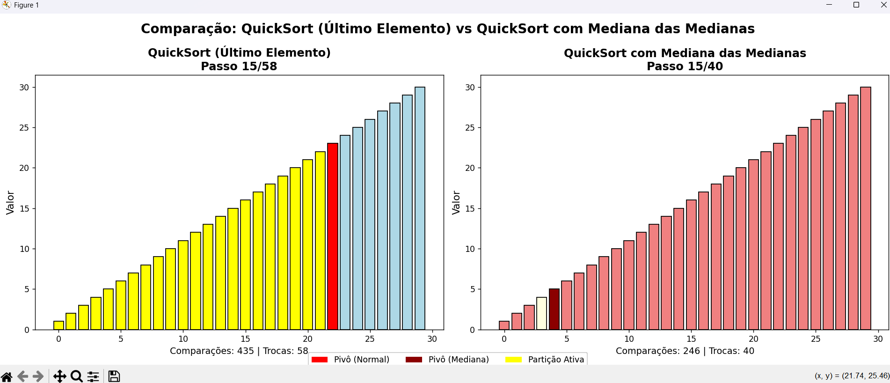
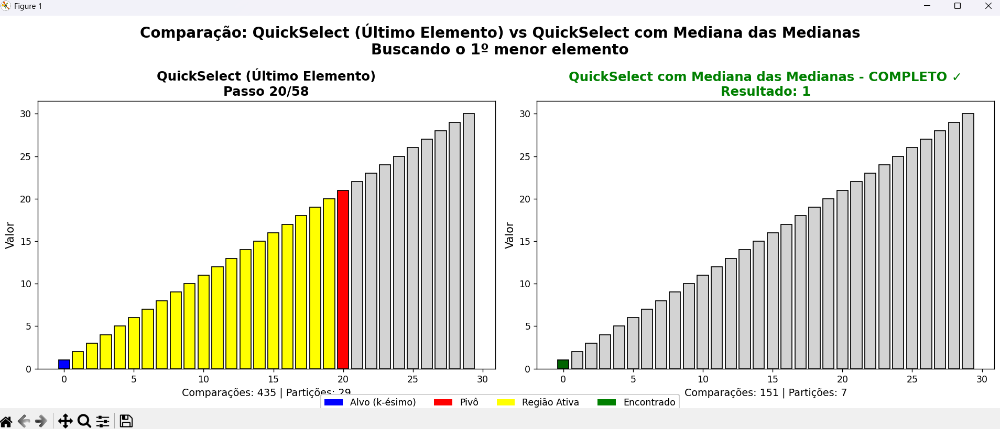

# Dividir_e_Conquistar_Densidade_Grafica


# Análise de Estratégias de Pivô em Algoritmos de Divisão e Conquista

**Conteúdo da Disciplina**: Dividir e Conquista

## Alunos

| Matrícula | Aluno |
| -- | -- |
| 231026901 | Caio Ferreira Duarte |
| 211029601 | Victor Pontual Guedes Arruda Nobrega |

## Sobre
Este projeto foca na **análise e visualização de algoritmos de Divisão e Conquista**, especificamente o **QuickSort** e o **QuickSelect**. 
Ele oferece uma **comparação visual** entre diferentes estratégias de seleção de pivô, destacando a diferença de desempenho entre uma abordagem padrão (como escolher o último elemento) e o método da **Mediana das Medianas**, especialmente em cenários de pior caso.

## Algoritmos (visão geral)

### QuickSort e QuickSelect
O **QuickSort** é um algoritmo de ordenação clássico, enquanto o **QuickSelect** é usado para encontrar o k-ésimo menor elemento em uma lista. A eficiência de ambos depende crucialmente da escolha do pivô. Em casos desfavoráveis, sua complexidade pode degradar para O(n²).

### Estratégia de Pivô: Mediana das Medianas
A **Mediana das Medianas** é um algoritmo de seleção de pivô que garante um desempenho de tempo linear no pior caso para o QuickSelect e O(n log n) para o QuickSort. Ele funciona dividindo a lista em subgrupos, encontrando a mediana de cada um e, recursivamente, encontrando a mediana dessas medianas para escolher um pivô de boa qualidade.

## Exemplo de Uso

Ao executar o programa, o usuário pode escolher entre visualizar o `QuickSort` ou o `QuickSelect`. Em seguida, pode selecionar uma estratégia de pivô convencional (último elemento, primeiro, aleatório, etc.) para comparar com a estratégia da "Mediana das Medianas".

A aplicação gera uma animação que exibe a execução passo a passo de ambos os algoritmos, lado a lado, juntamente com estatísticas como número de comparações e trocas/partições.

## Screenshots
Exemplo da execução do Quick Sort:

<p align="center">
  
</p>

Exemplo da execução do Quick Select:
<p align="center">
  
</p>

## Instalação
Requisitos:
- Python 3.8+

Passos:
1. Clonar o repositório.
2. (Opcional) Criar e ativar um ambiente virtual.

```powershell
python -m venv .venv
./.venv/Scripts/Activate.ps1
```

3. Instale as dependências:
```powershell
pip install -r requirements.txt
```

## Uso

1. Abra um terminal na pasta do projeto.


2. Execute:

```
python app.py
```

## Apresentação

Vídeo disponível em:
https://youtu.be/yI_kjr9UTKI


Apresentação: https://youtu.be/22VbiqcumpQ
